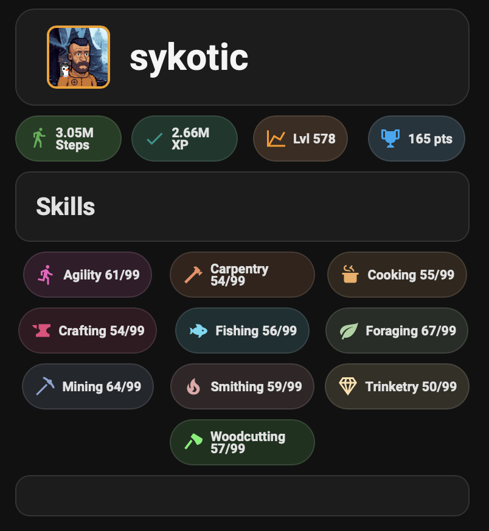

# WalkScape Home Assistant Integration

A Home Assistant dashboard card that displays your WalkScape character profile with live stats and skill levels.



## Features

- 📊 Real-time character stats (Steps, XP, Total Level, Achievement Points)
- 🎯 Individual skill progress with color-coded displays
- 🎨 Matches the WalkScape website design aesthetic
- 🔄 Auto-updates every 30 minutes

## Prerequisites

### HACS Plugins Required
- [Mushroom Cards](https://github.com/piitaya/lovelace-mushroom)
- [card-mod](https://github.com/thomasloven/lovelace-card-mod)

Install both through HACS → Frontend.

## Installation

### 1. Add REST Sensors

Add the following to your `configuration.yaml`:

```yaml
rest: !include Walkscape_sensors.yaml
```

**Note:** Replace `YOUR-CHARACTER-ID` with your WalkScape character ID from your profile URL.

### 2. Find Your Character ID

1. Go to [WalkScape Portal](https://portal.walkscape.app/)
2. Navigate to your profile
3. Copy the character ID from the URL: `https://portal.walkscape.app/profile/YOUR-CHARACTER-ID`

### 3. Restart Home Assistant

Restart Home Assistant to load the new sensors.

### 4. Add the Lovelace Card

Copy the contents of `walkscape-card.yaml` to your Lovelace dashboard in YAML mode, or add it as a Manual card.

**Important:** Update the profile picture URL in the card YAML with your character ID.

## Customization

### Update Skill Levels

The card displays hardcoded skill levels. Update the numbers in the card YAML to match your current levels:

```yaml
content: 'Agility 61/99'  # Change to your current level
```

### Change Colors

Each skill has a unique color. Modify the RGB values in the `card_mod` sections to customize colors.

### Adjust Update Frequency

Change `scan_interval: 1800` (30 minutes) in the REST sensor configuration to your preferred interval in seconds.

## File Structure

```
.
├── README.md
├── configuration.yaml         # REST sensor configuration
├── walkscape-card.yaml       # Lovelace card configuration
└── screenshot.png            # Example screenshot
```

## Troubleshooting

### Sensors show "Unknown" or "Unavailable"
- Verify your character ID is correct
- Check that your WalkScape profile is set to public in the game settings
- Restart Home Assistant after adding sensors

### Card doesn't display correctly
- Ensure Mushroom Cards and card-mod are installed via HACS
- Clear your browser cache
- Check browser console for errors

### Font size issues
- card-mod must be installed and loaded properly
- Try a hard refresh (Ctrl+F5 / Cmd+Shift+R)

## Credits

- [WalkScape](https://walkscape.app/) - The amazing fitness RPG game
- [Mushroom Cards](https://github.com/piitaya/lovelace-mushroom) - Beautiful Home Assistant cards
- [card-mod](https://github.com/thomasloven/lovelace-card-mod) - CSS styling for Lovelace

## License

MIT License - Feel free to use and modify!

## Support

For issues or questions, please open an issue on GitHub or visit the [WalkScape Discord](https://discord.gg/walkscape).